### <code>yazan0arar@github ~ $ ./contributions.sh</code>

  

### <code>yazan0arar@github ~ $ whoami</code>

<table>
  <tr>
    <td valign="top"></td>
    <td valign="top"></td>
  </tr>
</table>

 

### <code>yazan0arar@github ~ $ ./connect.sh</code>

<code><a href="https://github.com/yazan0arar">GitHub</a></code>
&nbsp;·&nbsp;
<code><a href="https://www.linkedin.com/in/yazan-arar-663a52367/">LinkedIn</a></code>
&nbsp;·&nbsp;
<code><a href="mailto:yazanarar32@gmail.com">Email</a></code>
&nbsp;·&nbsp;
<code><a href="https://github.com/yazan0arar/DrPlant---Plant-Disease-Detection-System-">Doctor Plant</a></code>

